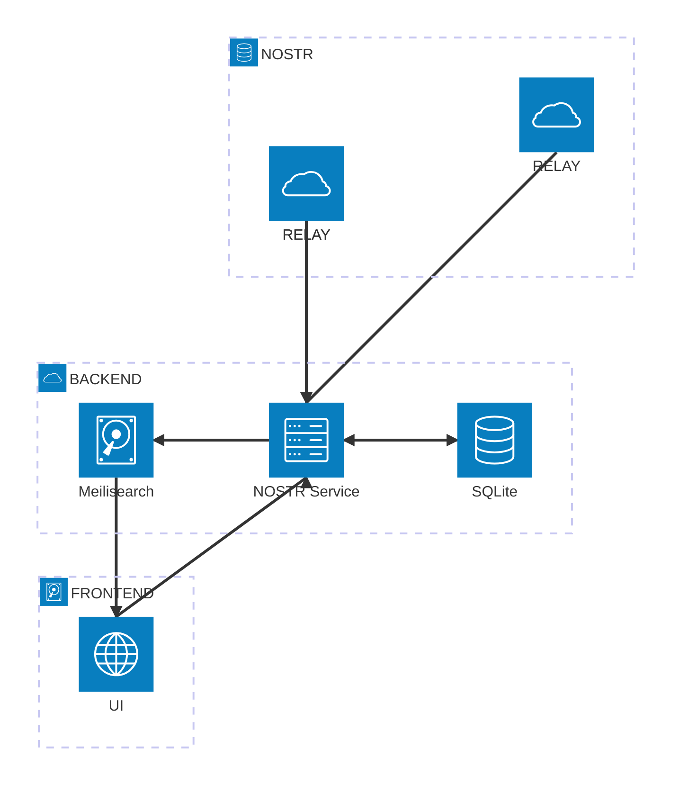

# Nostr Explorer

## Architecture



## Commands for testing

**Download my kind 1 events and save as JSON**  
`echo npub1k2vcw6agtcea54exjfrl07g6acp97k7jhs3f42zu0yy0xlqsequqsjfh9l | nak fetch --relay wss://relay.damus.io --kind 1 | jq -s '.' > kind1.json`

**Run a discardable relay**  
`nak serve`

**Upload events in a JSON file to Meilisearch**  
```
curl \
  -X POST 'http://localhost:7700/indexes/events/documents?primaryKey=id' \
  -H 'Content-Type: application/json' \
  -H 'Authorization: Bearer aSampleMasterKey' \
  --data-binary @kind1.json
```

**Get API Keys for Meilisearch**  
```
curl -X GET 'http://localhost:7700/keys' \
-H 'Authorization: Bearer MASTER_KEY'
```
