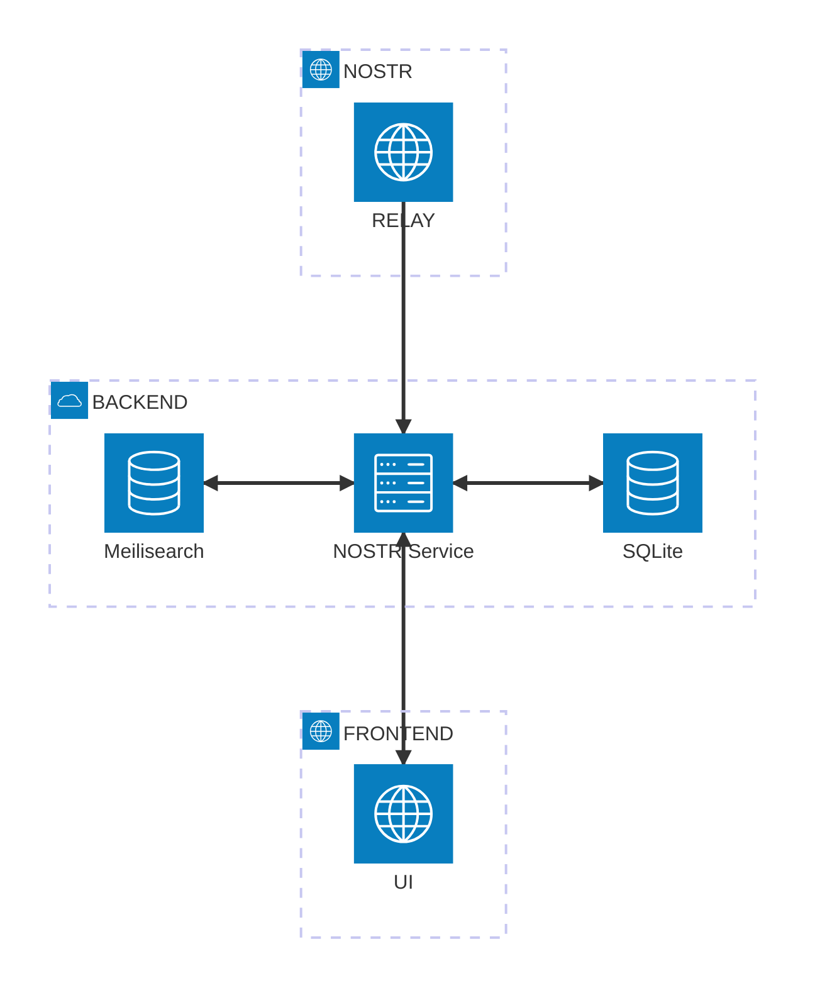

# Nostr Explorer

 

Nostr explorer is a tool to periodically fetch nostr events that you care about, 
index them in a search engine, and provide a UI to search and preview them. The idea is not for this 
to be used as a nostr client (I don't intend to host it publically), but to be run in a 
home server and used as a developer or personal tool.


## Usage
This is very much WIP, so these instructions are mostly for my own benefit.  

```sh
# 1. Install dependencies
bun i

# 2. Launch meilisearch
docker compose up

# 3. Create and setup master key
## Generate a key
openssl rand -hex 24
## Go to meilisearch dashboard and add it there
open http://localhost:7700
## In the browser devtools add it in local storage, with key meilisearch_token

# 4. Load some data in meilisearch
## See command below. You will need to setup nak for it.

# 5. Launch the dev servers
bun dev
```

## Architecture



## Commands for testing

**Download my kind 1 events and save as JSON**  
`echo npub1k2vcw6agtcea54exjfrl07g6acp97k7jhs3f42zu0yy0xlqsequqsjfh9l | nak fetch --relay wss://relay.damus.io --kind 1 | jq -s '.' > kind1.json`

**Run a discardable relay**  
`nak serve`

**Upload events in a JSON file to Meilisearch**  
```sh
curl \
  -X POST 'http://localhost:7700/indexes/events/documents?primaryKey=id' \
  -H 'Content-Type: application/json' \
  -H 'Authorization: Bearer aSampleMasterKey' \
  --data-binary @kind1.json
```

**Get API Keys for Meilisearch**  
```sh
curl -X GET 'http://localhost:7700/keys' \
-H 'Authorization: Bearer MASTER_KEY'
```

**Generate random master key**
```sh
openssl rand -hex 24
```
